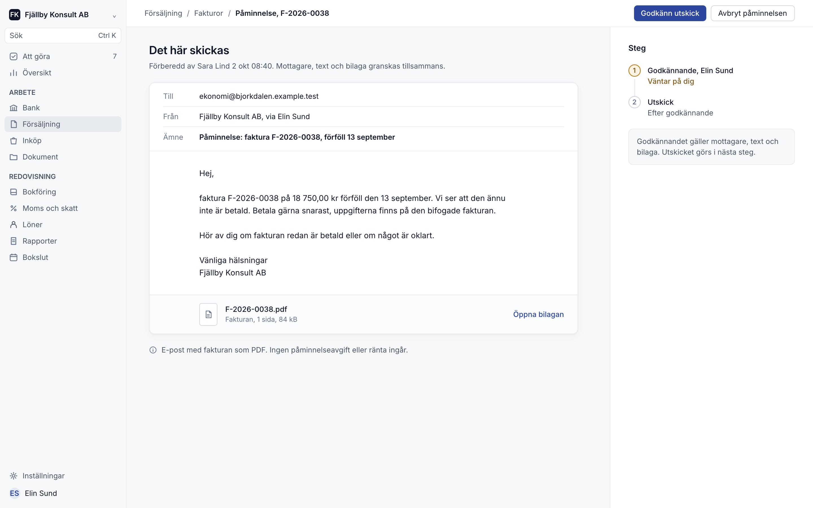
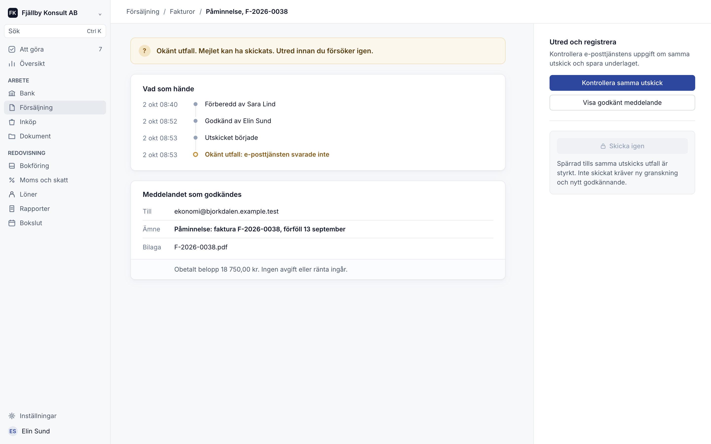
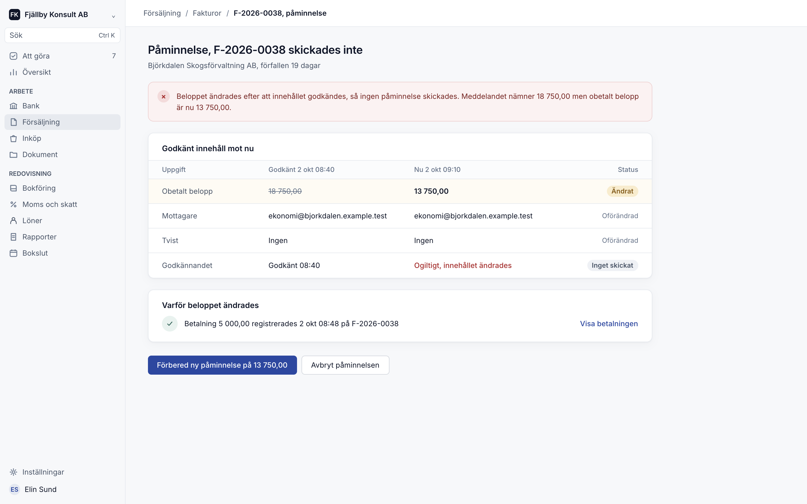

<p align="center">
  
</p>

Open-source accounting software for Swedish aktiebolag. Double-entry bookkeeping where every posting is traceable to its source and approved by a person before it hits the ledger, built to be operated by you, your accountant or your AI agent.

[](LICENSE) [](https://github.com/erik-kroon/drastic/actions/workflows/ci.yml)

[Self-host](infra/self-host/README.md) | [Documentation](docs/README.md) | [Architecture](docs/architecture.md) | [Connect an agent](apps/api/docs/MCP.md) | [Contribute](CONTRIBUTING.md)

> **Development software.** Modules have different levels of implementation and verification. Drastic is not yet qualified for live company books or statutory filing. Evaluate it with synthetic data.

## Why Drastic?

**Approve the exact effect.** Software prepares the work; a person approves it. Approval binds to a stored revision, and execution rechecks authority and current state, so a change after approval invalidates it instead of slipping through. Posted history is immutable and corrected through linked corrections.

**Recover uncertain results.** When an outcome is unknown, such as a posting whose response was lost or a reminder whose email provider never answered, Drastic records it as unknown and blocks the retry until the original attempt is checked. Retries recover the original receipt instead of duplicating effects.

**Agent-native.** Web, REST and MCP clients call the same application operations. Book-scoped MCP tools let an agent gather evidence, draft entries and reconcile transactions; the agent proposes, a person approves.

**Yours to run.** AGPL-3.0-only and self-hostable with Docker, Bun and PostgreSQL. The accounting core and agent interface need no paid service.

## Collections, designed for what goes wrong

<table>
  <tr>
    <td width="33%"></td>
    <td width="33%"></td>
    <td width="33%"></td>
  </tr>
  <tr>
    <td><b>Approve exact content.</b> Recipient, text and attachment are approved together; sending is a separate step.</td>
    <td><b>Unknown outcome.</b> The provider never answered, so resending stays locked until the first send is checked.</td>
    <td><b>Changed payment.</b> A payment after approval invalidates the reminder instead of chasing the wrong amount.</td>
  </tr>
</table>

<sub>Product designs with synthetic data.</sub>

## Features

- **Double-entry bookkeeping** with sequential voucher numbering, exact amounts and approval before posting
- **Invoicing** with drafts, PDF generation, credit notes and payment tracking
- **Recurring invoices** from versioned agreements, with pauses, missed-period handling and restart recovery
- **Collections and reminders** with exact message review, separate approval and dispatch, and changed-payment refusal
- **Supplier invoices** with a document inbox, review, purchase recognition and payment batches
- **Bank reconciliation** with statement imports, match candidates and reconciliation sign-offs
- **VAT preparation** with reviewed VAT facts, return calculations and ledger controls
- **Corporate tax preparation** with tax adjustments and INK2/SRU export preparation
- **Skattekonto** transactions matched to ledger entries
- **Financial reports** with drilldown from every total to its source entries
- **Foreign currencies** with reviewed exchange rates, settlements and exchange differences
- **Payroll preparation, fixed assets and period closing**
- **SIE import and export**
- **Accountant workspaces** with multiple client books, assignments and access control
- **Agent access (MCP)** with book-scoped tools, plus REST and OpenAPI for integrations

## Self-hosting

Install the Bun version pinned in [`package.json`](package.json), Docker Engine and Docker Compose v2, then run:

```bash
git clone https://github.com/erik-kroon/drastic.git
cd drastic
bun infra/self-host/setup.ts
docker compose --env-file infra/self-host/.env -f infra/self-host/compose.yaml up --build -d
```

Open <http://localhost:3000>. The [self-hosting guide](infra/self-host/README.md) covers creating your first book and account; there are no default credentials.

## Development

Prerequisites: Bun (version pinned in [`package.json`](package.json)) and PostgreSQL 17. See [local development](docs/local-development.md).

```bash
bun install --frozen-lockfile
bun run dev                  # API and web app
bun run build                # Production build
bun run check:changed        # Lint and types for changed files
bun run check:changed:full   # Full changed-file gate
```

Tests favour real workflows: the [API E2E suite](apps/api/tests/README.md) runs against real PostgreSQL, and [browser tests](verification/testerarmy/README.md) run against a fresh synthetic runtime.

## Tech stack

- **Language**: TypeScript (strict) across frontend and backend
- **Backend**: Effect, Effect Schema, PostgreSQL with Drizzle, effect-mq background jobs
- **Frontend**: React, TanStack Start and Query, StyleX, Base UI
- **Runtimes**: Bun/Docker self-hosting and Cloudflare Workers
- **Interfaces**: REST with OpenAPI, and MCP for agents

## Repository map

| Path | Purpose |
| --- | --- |
| [`apps/api/src/application`](apps/api/src/application) | Application workflows and financial transaction owners |
| [`apps/api/src/transport`](apps/api/src/transport) | HTTP and MCP admission |
| [`apps/api/src/db`](apps/api/src/db) | Scoped persistence and PostgreSQL access |
| [`apps/web`](apps/web) | React/TanStack workspaces |
| [`packages/domain`](packages/domain) | Exact financial values and calculations |
| [`packages/contracts`](packages/contracts) | Shared API schemas |
| [`packages/ui`](packages/ui) | Shared components and StyleX tokens |
| [`jurisdictions/se`](jurisdictions/se) | Swedish VAT and SIE formats |
| [`infra`](infra) | Self-hosting and deployment |

## Design decisions

- [Application-owned accounting](docs/adr/0010-application-owned-accounting-replacement.md): one owner for policy, authorization and transactions across all clients
- [Exact posting and approval](docs/adr/0002-exact-posting-and-approval.md): integer minor units, revision-bound approval and recoverable receipts
- [Background jobs](docs/adr/0009-effect-mq-background-jobs.md): jobs schedule work but never own balances

More in the [documentation index](docs/README.md) and the [API map](apps/api/README.md).

## Contributing

Contributions are welcome. Read the [contributing guide](CONTRIBUTING.md) first. Report security issues as described in [SECURITY.md](SECURITY.md), never in a public issue.

## License

[AGPL-3.0-only](LICENSE). Third-party material keeps its own notices; see [LICENSING.md](LICENSING.md). Drastic was previously developed as OpenERP.
